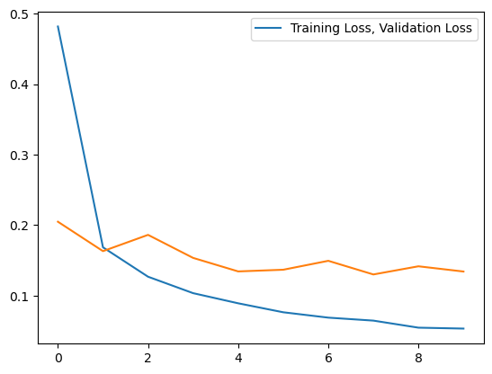

# Ecommerce-Text-Classification

## Project Description

This project aims to develop an intelligent deep-learning solution to streamline the categorization of products on e-commerce platforms. Recognizing the richness of data in text documents and their potential to shape market trends and investment flows, the project seeks to automate the often manual and time-consuming task of product categorization. The machine learning model will be trained to categorize unseen products into four specific categories: “Electronics”, “Household”, “Books”, and “Clothing & Accessories”. This will enable businesses to focus on specific types of products, thereby saving time and resources, and potentially influencing market trends.

## Data Description

The dataset utilized for this project is sourced from [Ecommerce Text Classification](https://www.kaggle.com/datasets/saurabhshahane/ecommerce-text-classification)

Data Example:
Here are some key characteristics of the dataset:

* File Type : .csv
* Type of Data: Multivariate
* Total Instances: 50425
* Class Count: 4 (Electronics, Household, Books, and Clothing, Accessories)
* Field of Study: Computer Science
* Attribute Characteristics: Real
* Total Attributes: 1
* Intended Use: Classification

## Results

Model Score:

  

Loss Graph:

  

Metric Graph:

  

## Workflow

### 1. Setup
> First and foremost, set up our development environment. This involves the installation and importation of necessary libraries that provide the tools and functionalities required for our tasks.

### 2. Data Loading
> The datasets are downloaded and pasted into the same directory as the main Python file. Dataset is loaded to the project using `pd.read_csv`

### 3. Data Exploratory
> In this phase, we conducted a comprehensive review of the data details. This involved verifying that certain features were correctly in specific types and inspecting the dataset for any duplicate values.

### 4. Data Preprocessing
> This section starts by cleaning the dataset, specifically by removing rows with NaN values. Next, we will do feature and label selection which we isolate the features and labels from the dataset. Finally, performs label encoding on the ‘category’ column.

### 5. Train Test Split
> Splitting the features and labels into training and testing sets, with 80% of the data going to the training set using `train_test_split`

### 6. Tokenization
> We're converting the text into a format that our model can understand. We define a tokenizer with specific parameters and fit it into the training data. The text data is then transformed into numerical sequences, making it suitable for the model.

### 7. Padding and Truncating
> In this section, we standardize the length of our token sequences using the pad_sequences function from `keras.utils`, applying it to both training and testing sets. We then create a reversed word index to map numerical identifiers back to words, enabling us to decode our token sequences into readable text. Lastly, we define a `decode_tokens` function to convert sequences of tokens back into strings of words, which is useful for data inspection and result interpretation.

### 8. Model Development
> We will concentrate on the development of the LSTM model across its various layers and also setting all the callbacks to be used for model training later. Model architecture is shown here:

  

### 9. Model Training
> As usual, we will train the model by calling the `model.fit()`. The training report is as per below:

  

### 10. Results
> We will be plotting the accuracy and loss graph here, the details are shown in the Result section at the top.
